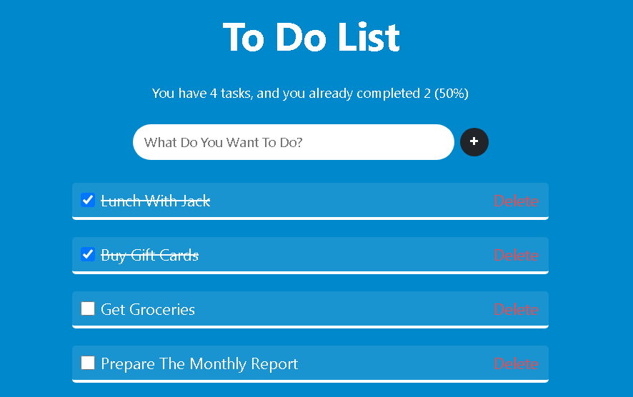

# 📝 To Do List App

A simple and clean To Do List app built with React.

## 📸 Screenshot



## ✅ Features

- Add new tasks
- Mark tasks as completed
- Delete tasks
- Track how many tasks are done
- Nice and responsive UI

## 🚀 How to Run

1. Open your terminal
2. Run the following commands:

```bash
npm install
npm start
